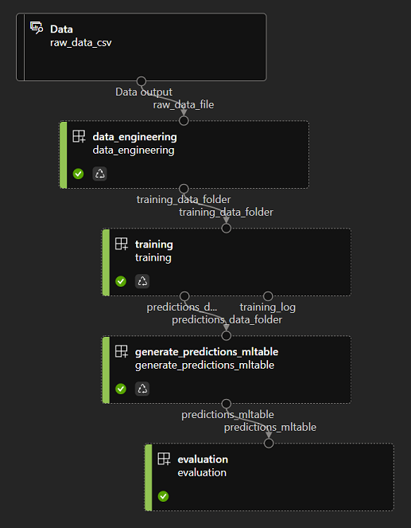

# azureml-v2-parallel-training

## project description (work in progress, still one issue in the last step)

This is an Azure ML CLIv2 template project demonstrating the use of the parallel job type.

We here have a simple pipeline with 4 steps:
- data-engineering, grabs data from one input in the datalake (raw_data.csv), this file is located under ./datalake/amlv2_pj_raw_data/ in this repo, create a datastore in AML named 'datalake', and setup the CSV file in this repo location into the datalake to match the pipeline input definition. The step loops thru all the tenants in this file, simulates some data-engineering being done to output one file per tenant. This will define a 'task' for each tenant, which in our case here will be to simulate training a model per tenant and infering predictions for further cross tenants performance evaluation.)
- training: setup to run on a compute cluster (multi nodes + multiple training processes per node) which dispatches each training data set to the processes in the cluster to get through the workload. Each tasks is processing one tenant training csv data set to train/infer and save evaluations.
- generate_predictions_mltable: this simple bash step just generates the MLTable descriptor inside the output of training (predictions) so we can load it in the next step as a simple Tabular mltable
- evaluation: reads the output of training as a Tabular dataset (dataset which is the composition of all the CSV files + some potenmtial transformations to format column types supported by MLTable). Here this step would perform an evaluation of the performance of each model or all models together against a test dataset.



This template also showcases how to pass training jobs parameters to a parallel step either as:
- environment variables which will automatically be setup on all training nodes (see 'env_var_1' in pipeline.yml and training.py)
- training script parameters (see 'param_1' in pipeline.yml and training.py)

The input of a parallel job relies on an [MLTable](https://docs.microsoft.com/en-us/azure/machine-learning/how-to-create-register-data-assets?tabs=CLI#create-a-mltable-data-asset) source.
Please have a look at the data-engineering.py code which generates an MLTable descriptor alonside the data (two ways defined there, explicit list of all files to be included as the MLTable definition, or use of * qualifier to grab everything in the folder). An MLTable can describe a Tabular data set (and apply transformations on the fly) or a File dataset (any type of file for a wide range of use cases).

The training job outputs fake predictions of the models to the 'prediction_data_folder' output, showcasing how to capture artifacts into a specific datalake location. The 'datalake' datastore has to be defined in your Azure ML environment, and would be pointint to a storage account container. The folder (path) defined in 'predictions_data_folder' will be created automatically in the datalake if it doesn't exist already.

```
outputs:
      predictions_data_folder:
        type: uri_folder
        mode: rw_mount
        path: azureml://datastores/datalake/paths/aml_v2_pj_prediction_data
```

## how to create and run the pipeline

[Install the Azure CLI + the Azure CLI 'ml' extension](https://docs.microsoft.com/en-us/azure/machine-learning/how-to-configure-cli?tabs=public), then run the following to create the steps runtime environment (repeat this any time you need to modify the 'conda' files in each step folder to support code changes):

```
az ml environment create -f ./data-engineering/data-engineering-environment.yml
az ml environment create -f ./training/training-environment.yml
az ml environment create -f ./evaluation/evaluation-environment.yml
```
To trigger a pipeline creation/run, run the following:

```
az ml job create -f pipeline.yml --web
```